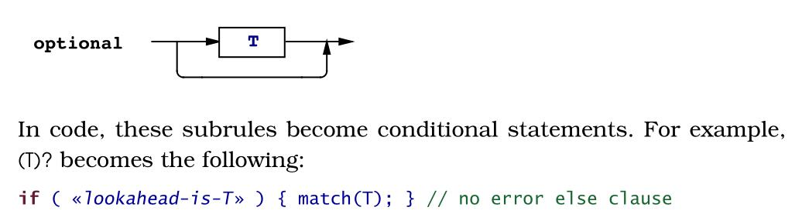
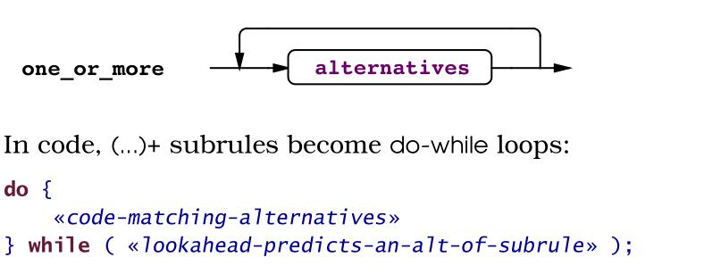
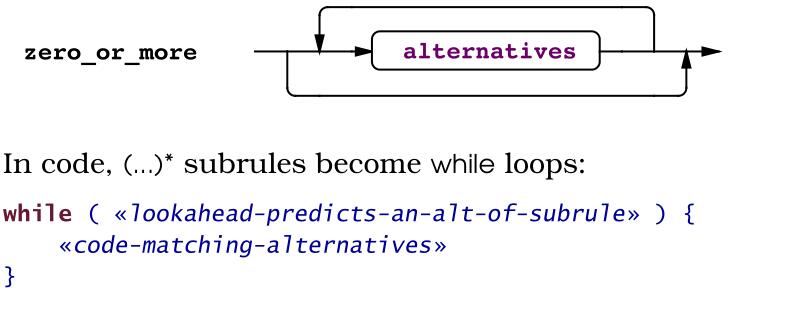

# Language-Implementation-Patterns
学习并实现编译器

#Preface 
    1 What to Expet from this book 
    2 How this book is organized 
    3 What you'll find in the patterns 
    4 Who should read this book 
    5 How to read this book 
    6 Languages and tools used in this book 
    
#Getting started with parsing 
    1 Language applications cracked open 
        1 The big picture 
        2 A tour of the patterns 
        3 Dissecting a few applications 
        4 Choosing patterns and assmbling applications
    
    2 Basic parsing patterns 
        1 Identifying pharse structe 
        2 Building recursive-descent parsers 
        3 Parser construction using a grammar DSl 
        4 Tokenizing sentences 
        5 Mapping grammars to recursive-descent recongnizers 
        6 LL(1) recursive-descent lexer 
        7 LL(1) recursive-descent parser 
        8 LL(K) recursive-descent parser 
### 以下则是从机械的角度来看待相应的问题,把语法规则视图化,然后进行翻译的操作

